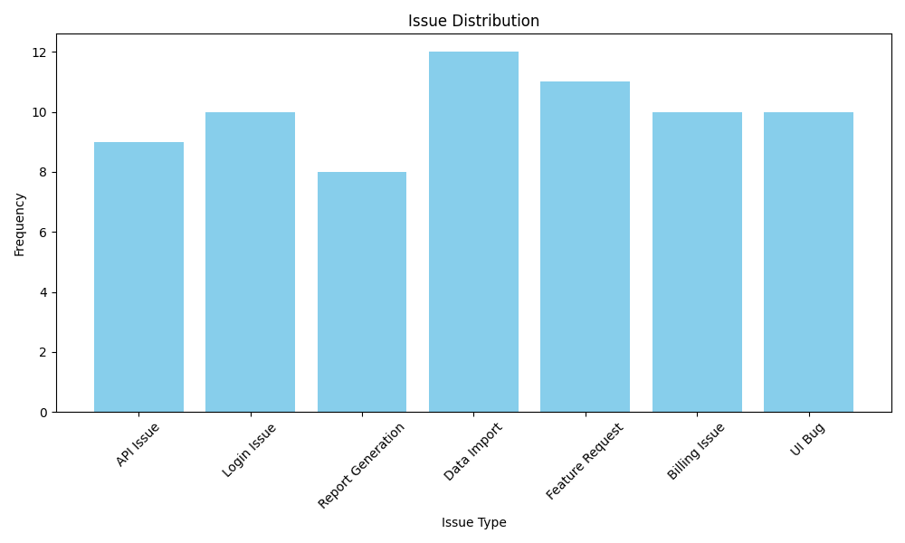
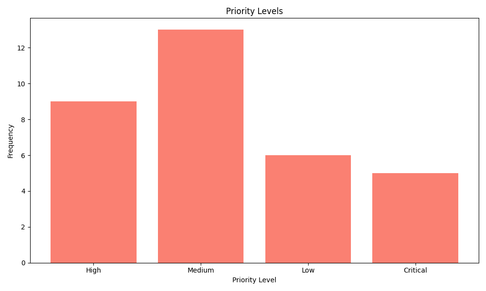
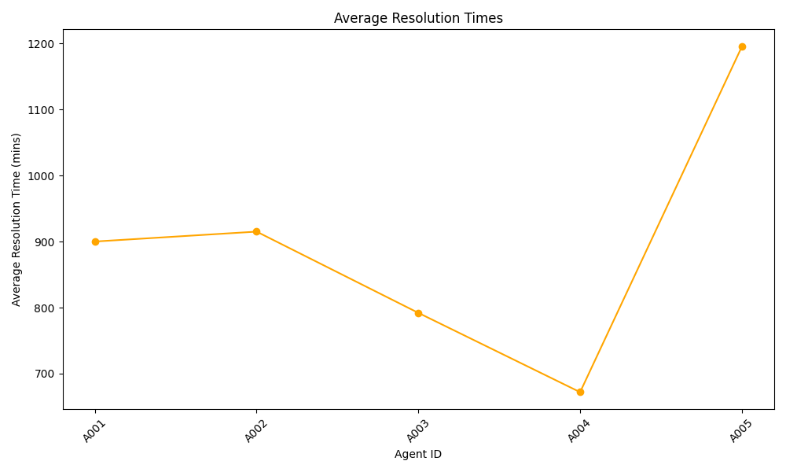
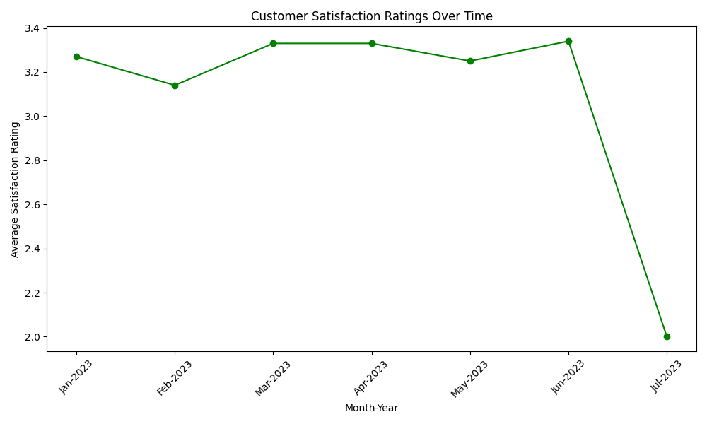

# Support Ticket Summary Report

## Executive Summary
This report provides insights into the support ticket data, including issue classification results, agent performance, customer satisfaction ratings, and suggested actions for improvement. The analysis highlights key trends and actionable recommendations to enhance service quality and customer satisfaction.

## Issue Classification Results
### Overview of Issues Reported

| Issue Type         | Frequency | Priority Levels               |
|--------------------|-----------|-------------------------------|
| API Issue          | 9         | High: 5, Medium: 3, Low: 1   |
| Login Issue        | 10        | High: 3, Critical: 2, Low: 5  |
| Report Generation   | 8         | High: 2, Medium: 2, Low: 4    |
| Data Import        | 12        | High: 5, Medium: 4, Low: 3    |
| Feature Request    | 11        | High: 5, Critical: 2, Low: 4  |
| Billing Issue      | 10        | High: 4, Medium: 4, Critical: 2|
| UI Bug             | 10        | Critical: 3, High: 4, Medium: 3|
| **Total**          | **70**    |                               |

### Issue Distribution

### Priority Levels

## Agent Performance
### Insights into Agent Performance

| Agent ID | Number of Resolved Tickets | Average Resolution Time (mins) | Average Satisfaction Score |
|----------|----------------------------|-----------------------------|---------------------------|
| A001     | 12                         | 900                         | 2.74                      |
| A002     | 9                          | 915                         | 3.89                      |
| A003     | 10                         | 792                         | 3.20                      |
| A004     | 15                         | 672                         | 3.08                      |
| A005     | 4                          | 1195                        | 3.25                      |

### Average Resolution Times

## Customer Satisfaction
### Customer Satisfaction Ratings Over Time

| Month-Year | Total Tickets | Average Satisfaction Rating |
|------------|---------------|-----------------------------|
| Jan-2023   | 11            | 3.27                        |
| Feb-2023   | 14            | 3.14                        |
| Mar-2023   | 15            | 3.33                        |
| Apr-2023   | 15            | 3.33                        |
| May-2023   | 12            | 3.25                        |
| Jun-2023   | 12            | 3.34                        |
| Jul-2023   | 1             | 2.00                        |
| **Total**  | **70**        | **3.26**                   |

### Customer Satisfaction Ratings Over Time Chart

## Suggested Actions
### Actionable Suggestions

- **API Issues**: Escalate recurring API issues to development for resolution and implement tracking mechanisms.
- **Login Issues**: Increase follow-up communication with customers facing login issues to ensure resolutions are effective.
- **Report Generation**: Conduct a comprehensive review of the report generation process to address reported issues.
- **Data Import**: Streamline the data import process to enhance efficiency and reduce ticket submissions.
- **Feature Requests**: Regular updates for customers regarding feature request timelines to manage their expectations.
- **Billing Issues**: Improve response times and establish clear communication regarding any billing-related concerns.
- **UI Bugs**: Enhance team training on handling UI bugs and ensure swift fixes to prevent recurrence.

## Conclusion
In summary, the analysis highlights critical areas needing attention, including faster resolution times, customer follow-up protocols, and ongoing training for support staff. By focusing on suggested actions, the support team can improve overall customer satisfaction and enhance service quality, ensuring a better experience for stakeholders moving forward.